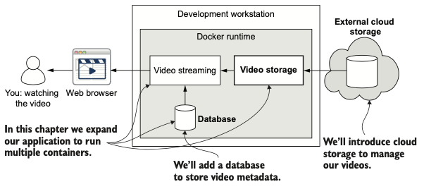
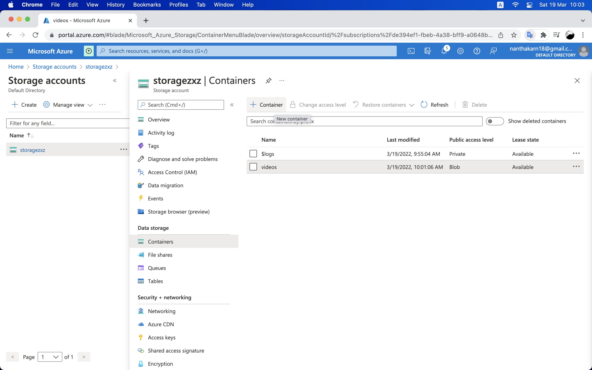
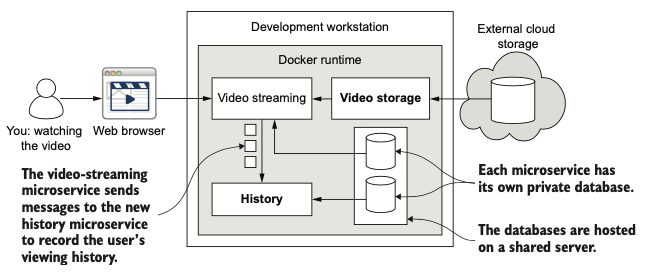
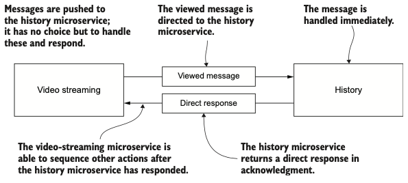
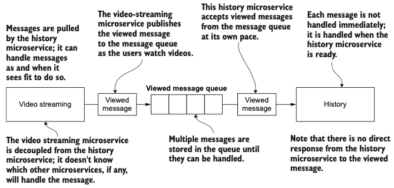

# Video Streaming Microservice <!-- omit in toc -->

This project is a tutorial to build microservices based on the [textbook](https://www.manning.com/books/bootstrapping-microservices-with-docker-kubernetes-and-terraform?a_aid=datawranglingwithjavascript&a_bid=f8e47dba) --Bootstrapping Microservices with Docker, Kubernetes and Terraform.

## Application <!-- omit in toc -->

- name: `FlixTube`
- have a browser-based front end
- contain services for:
  - video streaming
  - storage and upload
  - a gateway for the customer-facing front end

## Tools <!-- omit in toc -->

- `Node.js`: To build the microservices
- `Docker`: To package and deploy the services
- `Docker Compose`: To test the microservices application on the development workstation
- `Kubernetes`: To host the application in the cloud
- `Kubectl`: is the command-line tool for interacting with a Kubernetes cluster
- `Terraform`: To build the cloud infrastructure, the Kubernetes cluster, and deploy the application
- `Bitbucket Pipelines`: is automate the deployment service
- `Azure CLI`: is an Azure command-line tool, to authenticate and give Terraform access to Azure account
- `Azure Storage`: To store files in the cloud
- `MongoDB`: is a popular NoSQL database
- `HTTP`: To send direct (or synchronous) messages from one microservice to another
- `RabbitMQ`: To send indirect (or asynchronous) messages from one microservice to another
- `amqplib`: is a npm package allows us to configure RabbitMQ and to send and receive messages from JavaScript

## Architecture <!-- omit in toc -->


## Development (step-by-step hand-on) <!-- omit in toc -->

Source codes: [bootstrapping-microservices/repos](https://github.com/orgs/bootstrapping-microservices/repositories)

- [Chapter 2 Creating your first microservice](#chapter-2-creating-your-first-microservice)
- [Chapter 3 Publishing your first microservice](#chapter-3-publishing-your-first-microservice)
- [Chapter 4 Data management for microservices](#chapter-4-data-management-for-microservices)
- [Chapter 5 Communication between microservices](#chapter-5-communication-between-microservices)
- [Chapter 6 Creating your production environment](#chapter-6-creating-your-production-environment)
- [Chapter 7 Getting to continuous delivery](#chapter-7-getting-to-continuous-delivery)

### Chapter 2 Creating your first microservice

Building an HTTP server for video streaming

1. Create a Node.js project for our microservice.
2. Install Express and create a simple HTTP server.
3. Add an HTTP GET route /video that retrieves the streaming video.

Setup project

```bash
mkdir video-streaming
cd video-streaming

npm init -y
npm install --save express
```

Create router --[index.js](video-streaming/src/index.js)

```js
const express = require("express");

const app = express();
const port = 3000;

app.get("/", (req, res) => {
  res.send("Hello World!");
});

app.listen(port, () => {
  console.log(
    `First example app listening on port ${port}, point your browser at http://localhost:3000`
  );
});
```

> **Running**: to test/run the server, in video-streaming terminal run `node index.js` and go to http://localhost:3000

Update HTTP endpoint, In [index.js](video-streaming/src/index.js)

```js
// add
const fs = require("fs");

// update
app.get("/video", (req, res) => {
  const path = "../videos/SampleVideo_1280x720_1mb.mp4";
  fs.stat(path, (err, stats) => {
    if (err) {
      console.error("An error occurred ");
      res.sendStatus(500);
      return;
    }

    res.writeHead(200, {
      "Content-Length": stats.size,
      "Content-Type": "video/mp4",
    });
    fs.createReadStream(path).pipe(res);
  });
});
```

> **Running**: go to http://localhost:3000/video

Config environment

- setup env variable, in terminal

  ```bash
  export <key>=<value>
  ```

- in [index.js](video-streaming/src/index.js) using `process.env.<key>`

Setup production

- in terminal

  ```bash
  npm install --only=production
  ```

- in [package.json](video-streaming/package.json)

  ```json
  "scripts": {
      "test": "echo \"Error: no test specified\" && exit 1",
      // add
      "start": "node index.js"
  },
  ```

> **Running**: from now, using `npm start` convention

Create live reload pipeline

```bash
npm install --save-dev nodemon
```

> **Running**: to use nodemon, using `npx nodemon index.js`

> or add "start:dev": "nodemon index.js" in [package.json](video-streaming/package.json) scripts (just like above) to use `npm run start:dev` convention instead

Summary of Running Command

```bash
# install dependencies
npm install
# install as simulated production
npm install --only=production

# run
npm start
# run with live reload
npm run start:dev
```

### Chapter 3 Publishing your first microservice

Deploy the video streaming microservice to Docker registry

1. Package our microservice into a Docker image
2. Publish our image to our private container registry
3. Run our microservice in a container

Update directory structure

- create /src, move index.js in
- update [index.js](video-streaming/src/index.js)
- update [package.json](video-streaming/package.json)
- create /videos, move video in

Create [Dockerfile](video-streaming/Dockerfile)

```Dockerfile
FROM node:12.18.1-alpine

WORKDIR /usr/src/app
COPY package*.json ./

RUN npm install --only=production
COPY ./src ./src
COPY ./videos ./videos

CMD npm start
```

Create image

launch docker, then in terminal

```bash
# docker build -t <your-name-for-the-image> --file <path-to-your-Dockerfile> <path-to-project>
docker build -t video-streaming --file Dockerfile .
```

Create/Run container from our image

```bash
# docker run -d p <host-port>:<container-port> <image-name>
docker run -d -p 3000:3000 video-streaming
```

> **Checking**: run `docker container list` to check whether the container running or not, and run `docker logs <container_id>` to check the running server.

Publishing the image

- create account on `Microsoft Azure` (only first time)
- create container registry
  - in Microsoft Azure find [container registry service](https://portal.azure.com/#blade/HubsExtension/BrowseResource/resourceType/Microsoft.ContainerRegistry%2Fregistries)
  - create a registry (basic, name=zxz99)
  - go to Access keys, and Enabled Admin user
- login docker (not docker account)

  ```bash
  # docker login <your-registry-url> --username <your-username> --password <your-password>
  docker login zxz99.azurecr.io --username zxz99 --password <password_from_zxz99_access_keys>
  ```

- add tag to the image

  ```bash
  # docker tag <existing-image> <registry-url>/<image-name>:<version>
  docker tag video-streaming zxz99.azurecr.io/video-streaming:latest
  ```

- publish image to the registry

  ```bash
  # docker push <registry-url>/<image-name>:<version>
  docker push zxz99.azurecr.io/video-streaming:latest
  ```

- check Repositories (Microsoft Azure), you will see the image published with tag


> **Cleaning**: you can go ahead and delete all images from your local pc

> **Running**: everyone can run `docker run -d -p 3000:3000 zxz99.azurecr.io/video-streaming:latest` to create/run container from your published image

### Chapter 4 Data management for microservices

Adding both file storage and a database to our FlixTube example application (Adding database server and a second microservice to read from storage)



Create docker compose file

in [docker-compose.yml](docker-compose.yml)

```yml
version: "3"
services:
  video-streaming:
    image: video-streaming
    build:
      context: ./video-streaming
      dockerfile: Dockerfile
    container_name: video-streaming
    ports:
      - "4000:80"
    environment:
      - PORT=80
    restart: "no"
```

Build/Run docker compose, in terminal

```bash
docker-compose up --build
```

> **Checking**: to watch the video, checkout http://localhost:4000/video

for other commands

```bash
# shows list of docker-compose
docker-compose ps
# stop (not remove) container
docker-compose down
# do both to update code or dependencies
docker-compose down && docker-compose up --build
```

Docker Compose for production (short term)

- Create a virtual machine (VM) in the cloud and install Docker and Docker Compose. Then copy your application to the VM and boot it using Docker Compose. (con: limit horizontally scalability)

- Use the Docker Swarm hosted service (from the makers of Docker) to deploy your application defined by the Docker Compose file. (con: expensive --need paid package)

So, let use `Kubernetes`!

Create file storage

You can use `AWS S3` or `Google Cloud Storage`. But in this tutorial, we will use `Azure Storage`

- create azure storage
  - in Microsoft Azure find [storage account](https://portal.azure.com/#blade/HubsExtension/BrowseResource/resourceType/Microsoft.Storage%2FStorageAccounts)
  - create a storage account (standard, name=storagezxz, redundancy=GRS)
  - go to Access keys, and copy key1
- Upload video to the storage
  - go to Container (in azure storage account)
  - create a container (name=videos, access=blobs)
  - in that container, click upload...



Create new microservice to read the storage

- setup project

  ```bash
  # create new folder (microservice)
  mkdir azure-storage
  cd azure-storage

  # install packages
  npm init -y
  npm install --save express
  npm install --save-dev nodemon
  npm install --save azure-storage
  ```

- add [code](azure-storage/src/index.js)
- add [Dockerfile](azure-storage/Dockerfile)

Config environment

```bash
export PORT=3000
export STORAGE_ACCOUNT_NAME=storagezxz
export STORAGE_ACCESS_KEY=<access-key1>
```

> **Testing**: (after add line 8-9 in package.json) run `npm start` or `npm run start:dev` and go to http://localhost:3000/video?path=SampleVideo_1280x720_1mb.mp4

Update environment in [docker-compose.yml](docker-compose.yml)

Create database

- add database server, update [docker-compose.yml](docker-compose.yml)
- update [video-streaming/src/index.js](video-streaming/src/index.js)
- update package, in terminal

  ```bash
  cd video-streaming
  npm install --save mongodb
  ```

- re-build and run `docker-compose up --build`, add data to mondoDB (localhost:4000)

  - create database (name=video-streaming)
  - create collection (name=videos)
  - insert document to the collection

    ```json
    {
      "_id": { "$oid": "5d9e690ad76fe06a3d7ae416" },
      "videoPath": "SampleVideo_1280x720_1mb.mp4"
    }
    ```

> **Running**: keep the re-build running, then run another `docker-compose up --build` in /video-streaming and go to http://localhost:4002/video?id=5d9e690ad76fe06a3d7ae416

### Chapter 5 Communication between microservices



Sending messages between microservices, with

- `HTTP requests` -> direct messages
- `RabbitMQ` -> indirect messages

Create new microservice to store history

- setup project

  ```bash
  # create new folder (microservice)
  mkdir history
  cd history

  # install packages
  npm init -y
  npm install --save express
  npm install --save mongodb
  npm install --save-dev nodemon
  ```

- add [code](history/src/index.js)
- add Dockerfiles: [dev](history/Dockerfile-dev), [prod](history/Dockerfile-prod)
- update [docker-compose.yml](docker-compose.yml)

> **Notifying**: (after add line 8-9 in package.json) `--legacy-watch` argument disables the filesystem watch and, instead, uses a frequent polling mechanism to monitor for code changes.

> **Running**: for production run `npm start`, for testing run `npm run start:dev`, and for development within the container run `CMD npm start`

Messaging

We would prefer to avoid the tight coupling between our microservices, and for that reason, we will make frequent use of indirect messaging instead of direct messaging.

Direct messaging
| | |
| :----------------------------------------------: | :------------------------------------------------------------------------------------------------------------------------------------ |
|  | - immediate send and receive <br/> - often required for certain use cases <br/> - drawback: requires tight coupling btw microservices |

Indirect messaging
| | |
| :--------------------------------------------------: | :------------------------------------------------------------------------------------------------------------------------------------------------------------------------------------------------------------------- |
|  | - introduces an `intermediary` (message queue) btw the endpoints <br/> - much looser coupling <br/> - sender and receiver don’t know which other microservice is involved <br/> - receiver can’t send a direct reply |

Create HTTP messaging

do the same for both microservices (video-streaming, history)

- in terminal

  ```bash
  npm install --save body-parser
  ```

- update [index.js (video-streaming)](video-streaming/src/index.js), [index.js (history)](history/src/index.js)
  - `sendViewedMessage` to `send` a message
  - `setupHandlers` to `receive` a message
  - `startHttpServer` to start the service

> **Running**: run `docker-compose up --build`

Create RabbitMQ messaging

- create a RabbitMQ server, update [docker-compose.yml](docker-compose.yml)

- investigate RabbitMQ dashboard

  - run `docker-compose up --build`
  - go to http://localhost:15672/
  - login with default: username=guest, pwd=guest
  - click Queues tab to view message queues

- connect microservice to the message queue & single-recipient (1-to-1) message

  - in terminal

    ```bash
    # for both microservices
    npm install --save amqplib
    npm install --save wait-port
    ```

  - update [index.js (video-streaming)](video-streaming/src/index.js), [index.js (history)](history/src/index.js)
  - update [docker-compose.yml](docker-compose.yml) (set depends_on of both containers)
  - (fixed bug) for update [video-streaming/Dockerfile](video-streaming/Dockerfile), [history/Dockerfile-dev](history/Dockerfile-dev)

  > **Running**: run `docker-compose up --build`, go to http://localhost:4002/video, check output msg in your local mongoDB database

- multiple-recipient (1-to-many) message

  - update [index.js (video-streaming)](video-streaming/src/index.js), [index.js (history)](history/src/index.js)
  - create new microservices (for simulation)

    - setup project

    ```bash
    # create new folder (microservice)
    mkdir recommendations
    cd recommendations

    # install packages
    npm init -y
    npm install --save express
    npm install --save mongodb
    npm install --save-dev nodemon
    npm install --save amqplib
    npm install --save wait-port
    ```

    - add [code](recommendations/src/index.js)
    - add Dockerfiles: [dev](recommendations/Dockerfile-dev), [prod](recommendations/Dockerfile-prod)
    - update [docker-compose.yml](docker-compose.yml)

  > **Running**: run `docker-compose up --build`

### Chapter 6 Creating your production environment

Build production infrastructure with Terraform and create a Kubernetes cluster to host the microservices

Authenticate with Azure

- install [Azure CLI](https://docs.microsoft.com/en-us/cli/azure/install-azure-cli) (only first time)
- login Azure

  ```bash
  # login using browser
  $ az login
  ```

  ```bash
  # show account info
  $ az account show
  # set subscription
  $ az account set --subscription=<subscription-id>
  ```

- config Kubernetes versions in [providers.tf](working/scripts/providers.tf)

  ```bash
  # show table of Kubernetes versions
  $ az aks get-versions --location westus --output table
  ```

Create infrastructure with Terraform

use `infrastructure as code` to automate the process of infrastructure creation

- install [Terraform](https://www.terraform.io/downloads) (only first time)
- create [providers.tf](working/scripts/providers.tf) and [resource-group.tf](working/scripts/resource-group.tf)
- build/run Terraform

  ```bash
  $ cd working/scripts

  # initial (first time only)
  $ terraform init

  # build
  $ terraform apply
  # update (after add files)
  $ terraform apply -auto-approve

  # destroy
  $ terraform destroy
  ```

- create [container-registry.tf](working/scripts/container-registry.tf) -> resource.name (container name) need to be unique
- create [variables.tf](working/scripts/variables.tf), update [resource-group.tf](working/scripts/resource-group.tf)

Create Kubernetes cluster

- create [kubernetes-cluster.tf](working/scripts/kubernetes-cluster.tf)
- create service, take note of the output (`appId`, `password`)

  ```bash
  # (run `az account show`) get <subscription-id> as 'id'
  # create service principal
  $ az ad sp create-for-rbac --role="Contributor" --scopes="/subscriptions/<subscription-id>"
  ```

- create [private-key.tf](working/scripts/private-key.tf)
- update [variables.tf](/working/scripts/variables.tf)
  - client_id = `appId`
  - client_secret = `password`
- create Kubernetes cluster, take note of the output (`cluster_client_certificate`, `cluster_client_key`, and `cluster_cluster_ca_certificate` --credentials to interface with the cluster)

  ```bash
    # build cluster
    $ terraform apply -auto-approve
  ```

Interact with Kubernetes

- install [kubectl](https://kubernetes.io/docs/tasks/tools/) (first time only)
- authentication

  ```bash
  # auto initial .kube/config file
  $ az aks get-credentials --resource-group <app-name> --name <app-name>

  # test the authentication with kubectl
  $ kubectl get nodes
  ```

- install dashboard

  ```bash
  kubectl apply -f https://raw.githubusercontent.com/kubernetes/dashboard/v2.0.4/aio/deploy/ recommended.yaml
  ```

- connect dashboard (http://localhost:8001)

  ```bash
  kubectl proxy --address=0.0.0.0
  ```

### Chapter 7 Getting to continuous delivery

Configure Kubernetes with Terraform then deploy containers to Kubernetes cluster

Create an automated deployment pipeline, using Bitbucket Pipelines for continuous delivery

- configure Kubernetes, update [providers.tf](working/scripts/providers.tf)
- deploy database, create [database.tf](/working/scripts/database.tf)
- run automated deploying (same as before but add `client_id` and `client_secret` in arguments)

  ```bash
  terraform apply -var="client_id=<client-id>" -var="client_secret=<client-secret>" -auto-approve
  ```

> **Testing**: run `kubectl get services` to find external IP address

Deploy RabbitMQ server to Kubernetes

- create [rabbit.tf](working/scripts/rabbit.tf)
- run 'automated deploying cmd' (above) again

Deploy microservice to Kubernetes

- create [video-streaming.tf](/working/scripts/video-streaming.tf)
- build/publish the image (just like [ch.3](#chapter-3-publishing-your-first-microservice))
- run 'automated deploying cmd' (above) again

Continuous delivery with Bitbucket pipelines

- destroy current infrastructure

  ```bash
  terraform destroy
  ```

- sign up [Bitbucket](https://bitbucket.org) (first time only)
- in bitbucket, create a new repository for the project
- create a deployment shell script, create [deploy.sh](working/scripts/deploy.sh)
- manage the state, create [backend.tf](working/scripts/backend.tf)
- config pipelines, create [bitbucket-pipelines.yml](bitbucket-pipelines.yml)
- run `export VERSION=$BITBUCKET_BUILD_NUMBER`
- in bitbucket, config:
  - ARM_CLIENT_ID = `appId` from Kubernetes cluster service
  - ARM_CLIENT_SECRET = `password` from Kubernetes cluster service
  - ARM_TENANT_ID = `tenantId` from Azure subscription
  - ARM_SUBSCRIPTION_ID = `id` from Azure subscription

> **Testing**: push everything to see the pipeline status (in bitbucket)
